<center> <h1>CP4WatsonAIOps CP4WAIOPS v3.3</h1> </center>
<center> <h2>Demo Environment Installation - Short Track üöÄ</h2> </center>


<center> ©2022 Niklaus Hirt / IBM </center>


<div style="page-break-after: always;"></div>


### ‚ùó THIS IS WORK IN PROGRESS
Please drop me a note on Slack or by mail nikh@ch.ibm.com if you find glitches or problems.


<div style="page-break-after: always;"></div>

---------------------------------------------------------------
# Installation
---------------------------------------------------------------

## üöÄ Demo Installation

Those are the steps that you have to execute to install a complete demo environment:

1. [AI Manager Installation](#2-ai-manager-installation)
1. [AI Manager Configuration](#3-ai-manager-configuration)
1. [AI Manager Post Install Configuration](#4-ai-manager-post-install-configuration )
1. [AI Manager Finalize Configuration](#5-ai-manager-finalize-configuration )
1. [Slack integration](#6-slack-integration)
1. [Demo the Solution](#7-demo-the-solution)

> ‚ùóYou can find a PDF version of this guide here: [PDF](./INSTALL_CP4WAIOPS.pdf).
> 

## üöÄ TLDR - Fast Track

These are the high level steps that you need to execute to install the demo environment

1. Install AI Manager

	```bash
	ansible-playbook ./ansible/01_aimanager-base-install.yaml -e ENTITLED_REGISTRY_KEY=<REGISTRY_TOKEN> 
	```

1. [AI Manager Configuration](#3-ai-manager-configuration)

1. Launch Post Install

	```bash
	ansible-playbook ./ansible/02_aimanager-post-install.yaml
	```

1. [AI Manager Post Install Configuration](#4-ai-manager-post-install-configuration )

1. Launch Finalize Install

	```bash
	ansible-playbook ./ansible/03_aimanager-finalize-install.yaml
	```

1. [AI Manager Finalize Configuration](#5-ai-manager-finalize-configuration )
1. [Slack integration](#6-slack-integration)

<div style="page-break-after: always;"></div>

## ℹ️ In-depth documentation

* Info
	* [Changelog](./doc/CHANGELOG.md)
	* [Demo Architecture](./doc/ARCHITECTURE.md)
	* [Detailed Prerequisites](./doc/PREREQUISITES.md)
	* [Troubleshooting](./doc/TROUBLESHOOTING.md)
* Installation
	* [Event Manager Install](./doc/INSTALL_EVENT_MANAGER.md)
	* [Event Manager Configuration](./doc/CONF_EVENT_MANAGER.md)
	* [Manual AI Manager Install](./doc/INSTALL_AI_MANAGER.md)
	* [Uninstall CP4WAIOPS](./doc/UNINSTALL.md)
* Configuration
	* [Manual Runbook Configuration](./doc/CONF_RUNBOOKS.md)
	* [Additional Configuration](./doc/CONF_MISC.md)
	* [Service Now integration](./doc/INTEGRATION_SNOW.md)
	* [Manually train the models](./doc/TRAINING_MANUAL.md)
* Install additional components
	* [Installing Turbonomic](./doc/INSTALL_TURBONOMIC.md)
	* [Installing ELK ](./doc/INSTALL_ELK.md)
	* [Installing Humio](./doc/INSTALL_HUMIO.md)
	* [Installing ServiceMesh/Istio](./doc/INSTALL_SERVICE_MESH.md)
	* [Installing AWX/AnsibleTower](./doc/INSTALL_AWX.md)


<div style="page-break-after: always;"></div>

---------------------------------------------------------------
# 1 Introduction
---------------------------------------------------------------


This document is a short version of the full [README](./README_FULL.md) üê• that contains only the essential steps.


This is provided `as-is`:

* I'm sure there are errors
* I'm sure it's not complete
* It clearly can be improved


**‚ùóThis has been tested for the new CP4WAIOPS v3.3 release on OpenShift 4.8 on ROKS**


So please if you have any feedback contact me 

- on Slack: Niklaus Hirt or
- by Mail: nikh@ch.ibm.com


<div style="page-break-after: always;"></div>


---------------------------------------------------------------
# 2 AI Manager Installation
---------------------------------------------------------------


## 2.1 Get the code 

Clone the GitHub Repository

From IBM internal:

```
git clone https://<YOUR GIT TOKEN>@github.ibm.com/NIKH/aiops-install-ansible-fvt-33.git 
```

Or my external repo (this is updated less often than the IBM internal one):

```
git clone https://github.com/niklaushirt/cp4waiops-public.git
```


## 2.2 Prerequisites 

### 2.2.1 OpenShift requirements 

I installed the demo in a ROKS environment.

You'll need:

- ROKS 4.8
- 5x worker nodes Flavor `b3c.16x64` (so 16 CPU / 64 GB) 

You **might** get away with less if you don't install some components (Event Manager, ELK, Turbonomic,...) but no guarantee:

- Typically 3x worker nodes Flavor `b3c.16x64` _**for only AI Manager**_

<div style="page-break-after: always;"></div>

### 2.2.2 Tooling 

You need the following tools installed in order to follow through this guide:

- ansible
- oc (4.7 or greater)
- jq
- kafkacat (only for training and debugging)
- elasticdump (only for training and debugging)
- IBM cloudctl (only for LDAP)


#### 2.2.1 On Mac - Automated (preferred) 

Just run:

```bash
./10_install_prerequisites_mac.sh
```

#### 2.2.2 On Ubuntu - Automated (preferred) 

Just run:

```bash
./11_install_prerequisites_ubuntu.sh
```

 

<div style="page-break-after: always;"></div>

## 2.3 Pull Secrets 


### 2.3.1 Get the CP4WAIOPS installation token 

You can get the installation (pull) token from [https://myibm.ibm.com/products-services/containerlibrary](https://myibm.ibm.com/products-services/containerlibrary).

This allows the CP4WAIOPS images to be pulled from the IBM Container Registry.

<div style="page-break-after: always;"></div>


## 2.4 Install AI Manager 


### 2.4.1 Start AI Manager Installation 


1. Start the Easy Installer with the token from 2.3.1:

```bash
./01_easy-install.sh -t <REGISTRY_TOKEN>
```

2. Select option üê•`01` to install a base `AI Manager` instance.


Or directly run:

```bash
ansible-playbook ./ansible/01_aimanager-base-install.yaml -e ENTITLED_REGISTRY_KEY=<REGISTRY_TOKEN> 
```

> This takes about an hour.
> After completion Easy Installer will exit, open the documentation and the AI Manager webpage (on Mac) and you'll have to restart it for the next step.

> You now have a full, basic installtion of AI Manager with:
> 
>  - AI Manager
>  - Open LDAP
>  - RobotShop demo application
> 
> If you want to install the complete demo content, please continue with the next steps.

<div style="page-break-after: always;"></div>

## 2.5 Configure AI Manager 

There are some minimal needed configurations that you have to do to fully configure the demo environment.
Those are covered in the following chapters.

### Minimal Configuration
 
Those are the minimal configurations you'll need to demo the system and that are covered by the flow above.
 
 
**Basic Configuration**
 
1. Configure LDAP Logins

**Configure Topology**
 

1. Create REST Observer
1. Create Topology (automatic with script)

 
**Models Training**
 
1. Train the Models (automatic with script)
1. Create Integrations

**Advanced Configuration**

1. Enable Story creation Policy
1. Create AWX Connection
1. Create AI Manager Runbook (automatic with script)
1. Create Runbook Policy

**Configure Slack**
 
1. Setup Slack

 <div style="page-break-after: always;"></div>
 
---------------------------------------------------------------
# 3. AI Manager Configuration 
---------------------------------------------------------------

> ‚ùó Make sure the playbook `01` has completed before continuing


> You have to do the following:
> 
> 1. Login to AI Manager
> 1. Create REST Observer
> 1. Create Kubernetes Observer 
> 1. Run option `02` to run AI Manager post installation 

## 3.1 First Login

After successful installation, the Playbook creates a file `./LOGINS.txt` in your installation directory.

> ℹ️ You can also run `./tools/20_get_logins.sh` at any moment. This will print out all the relevant passwords and credentials.


* Open the `LOGINS.txt` file that has been created by the Installer in your root directory
	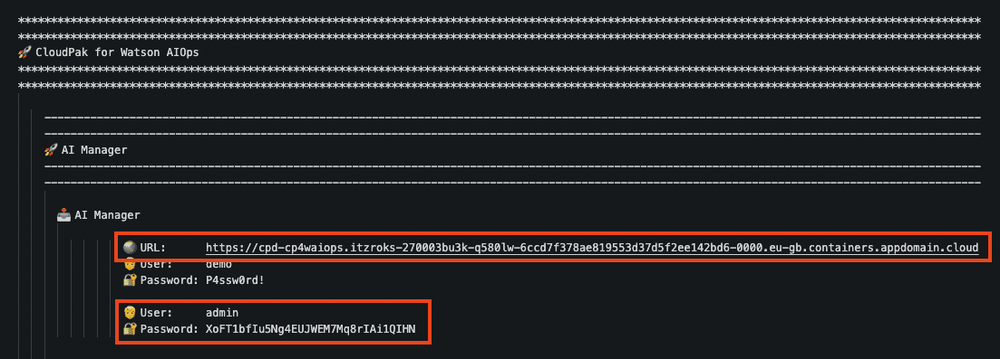
* Open the URL from the `LOGINS.txt` file
* Click on `IBM provided credentials (admin only)`

	

<div style="page-break-after: always;"></div>

* Login as `admin` with the password from the `LOGINS.txt` file

	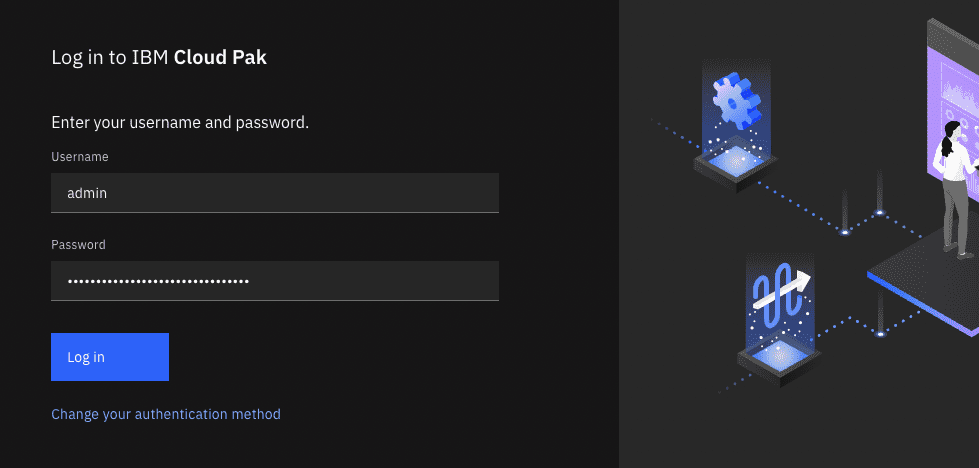

	
<div style="page-break-after: always;"></div>

## 3.2 Create Connections


### 3.2.1 Create REST Observer to Load Topologies

* In the `AI Manager` "Hamburger" Menu select `Operate`/`Data and tool integrations`
* Click `Add connection`

	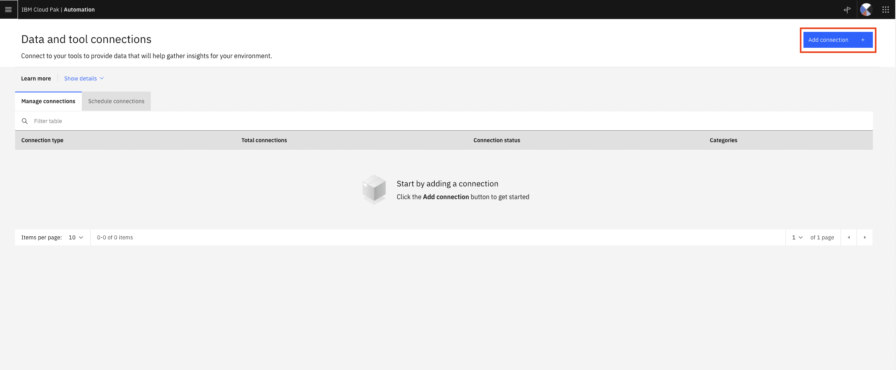

* On the left click on `Topology`

	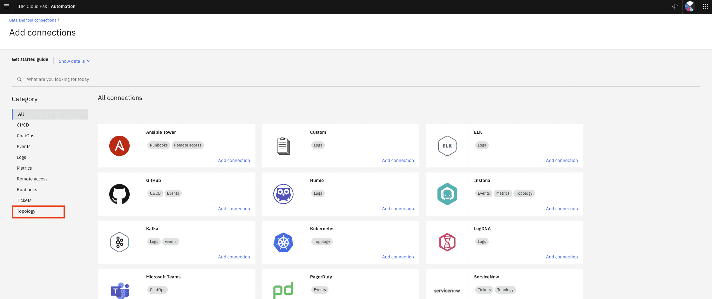

<div style="page-break-after: always;"></div>

* On the top right click on `You can also configure, schedule, and manage other observer jobs` 

	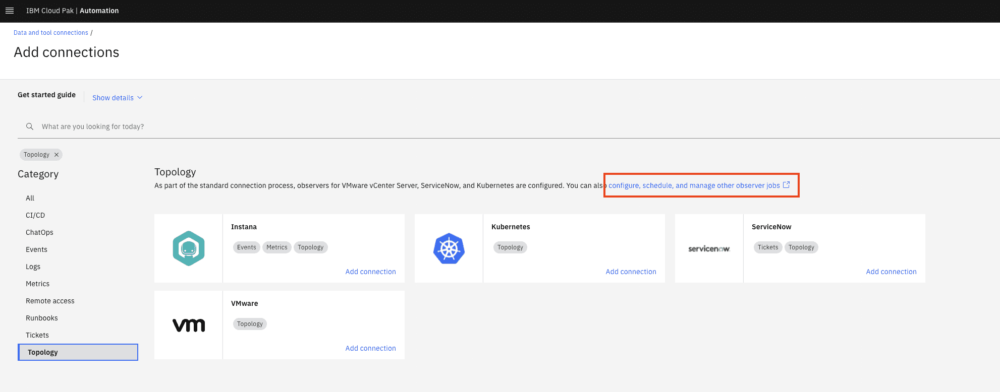

* Click on  `Add a new Job`

	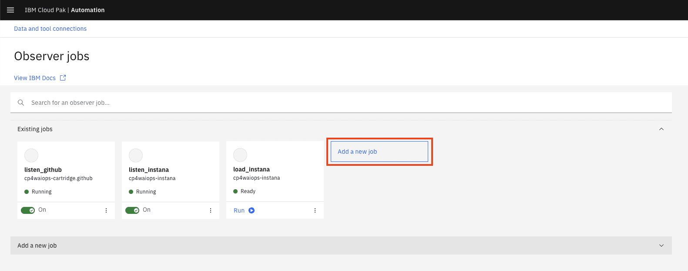

* Select `REST`/ `Configure`
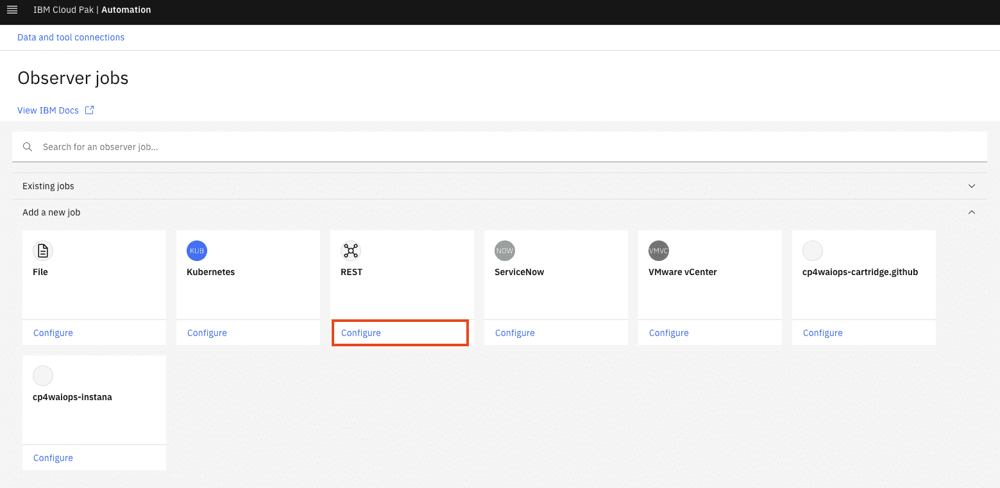

<div style="page-break-after: always;"></div>

* Choose `bulk_replace`
* Set Unique ID to `restTopology` (important!)
* Set Provider to whatever you like (usually I set it to “restTopology” as well)
 	
* `Save`


<div style="page-break-after: always;"></div>

### 3.2.2 Create Kubernetes Observer for the Demo Applications 🟢

Do this for your applications (RobotShop by default)

* In the `AI Manager` "Hamburger" Menu select `Operate`/`Data and tool integrations`
* Click `Add connection`

	
* On the left click on `Topology`

	

<div style="page-break-after: always;"></div>

* On the top right click on `You can also configure, schedule, and manage other observer jobs` 

	

* Click on  `Add a new Job`

	

* Select `Kubernetes`/ `Configure`

	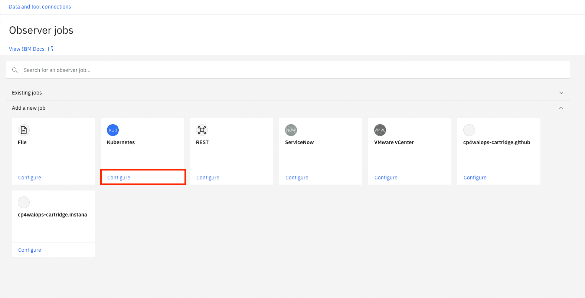


* Choose `local` for Connection Type
* Choose `robot-shop` for `Unique ID`
* Choose `robot-shop` for `data_center`

	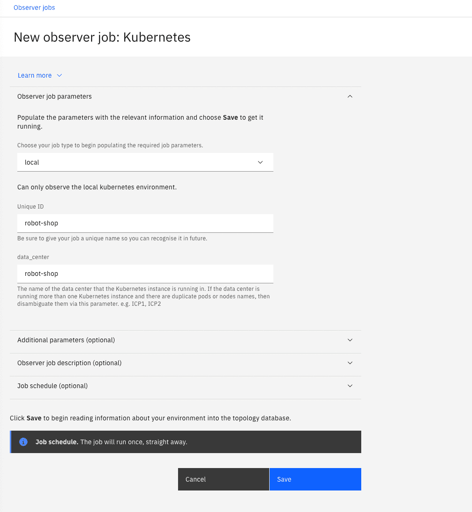


<div style="page-break-after: always;"></div>

* Under `Additional parameters`
* Set `Terminated pods` to `true`
* Set `Correlate ` to `true`
* Set `Namespace ` to `robot-shop`

	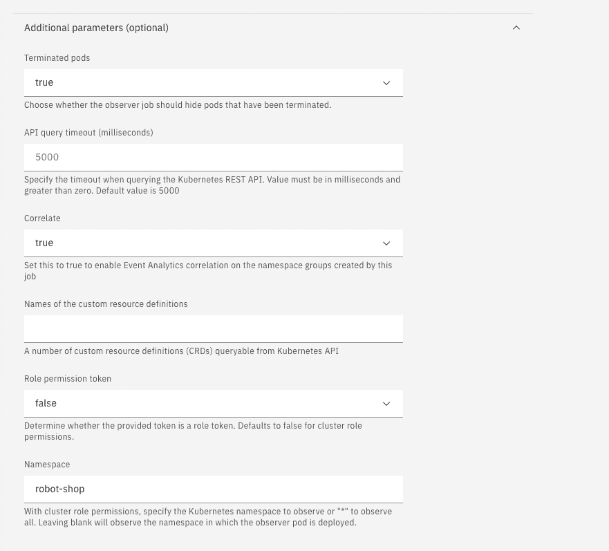


* Under `Job schedule`
* Set `Time interval Period` to `Minutes`
* Set `Number of Minutes` to `5`


	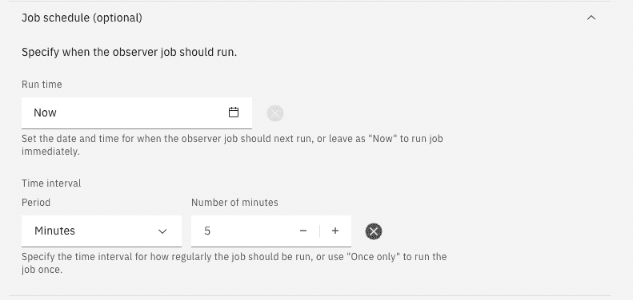


* Click `Save`

<div style="page-break-after: always;"></div>

## 3.3 Launch Post Install

1. Restart the Easy Installer:

```bash
./01_easy-install.sh
```

2. Select option üê•`02` for `AI Manager` post installation.


Or directly run:

```bash
ansible-playbook ./ansible/02_aimanager-post-install.yaml
```

This will:

1. Load Topology and Rules
1. Train the models (Load the training data, Create the training definitions, Launch the trainings)
1. Install AWX (Open Source Ansible Tower) for Runbook Automation


Training will be done for:
	
* Log Anomaly Detection (Logs)
* Temporal Grouping (Events)
* Similar Incidents (Service Now)
* Change Risk (Service Now)


> This takes about 30-45 minutes


<div style="page-break-after: always;"></div>

---------------------------------------------------------------
# 4. AI Manager Post Install Configuration 
---------------------------------------------------------------

> ‚ùó Make sure the playbook `02` has completed before continuing


> You have to do the following:
> 
> 1. Manually re-run the Kubernetes Observer
> 1. Add LDAP Logins to CP4WAIOPS
> 1. Enable Story creation Policy
> 1. Create Kafka ELK Log Inception Integration
> 1. Create Kafka Netcool Inception Integration
> 1. Create AWX Connection 
> 1. Run option `03` to finalize AI Manager demo installation 


## 4.1 Manually re-run the Kubernetes Observer 

‚ùó Please manually re-run the Kubernetes Observer to make sure that the merge has been done.


<div style="page-break-after: always;"></div>


## 4.2 Add LDAP Logins to CP4WAIOPS 


* Go to `AI Manager` Dashboard
* Click on the top left "Hamburger" menu
* Select `Access Control`

	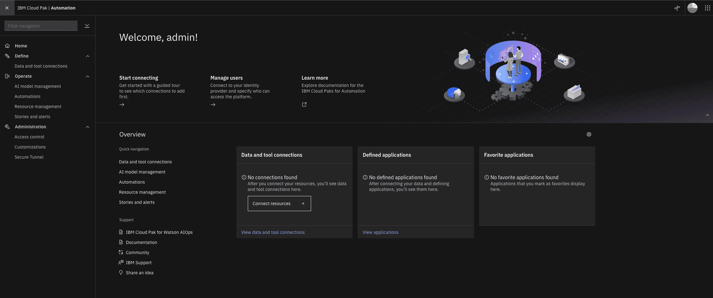
	
* Select `User Groups` Tab
* Click `New User Group`
	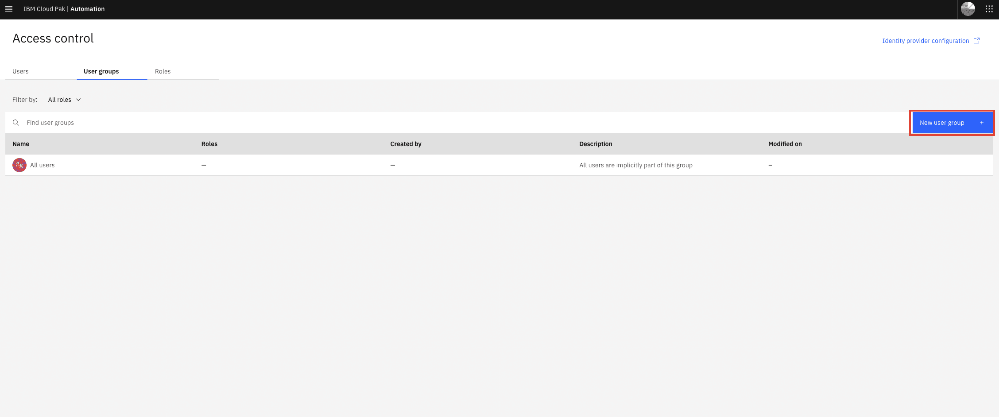

* Enter demo (or whatever you like)
	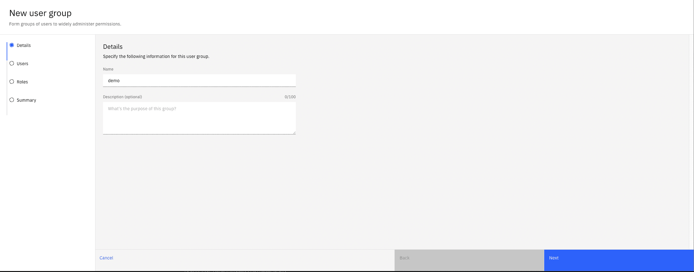

* Click Next
* Select `Identity Provider Groups`
* Search for `demo`
* Select `cn=demo,ou=Groups,dc=ibm,dc=com`
	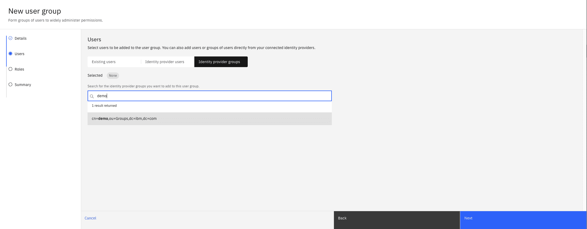

* Click Next
* Select Roles (I use Administrator for the demo environment)

	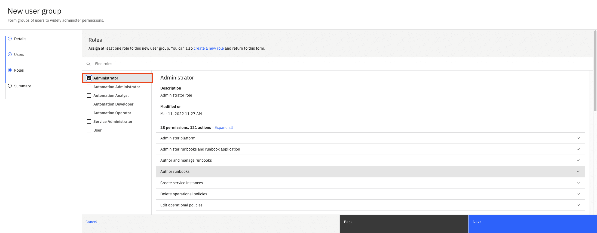
	
* Click Next
* Click Create


* Click on the top right image
* Select `Logout`

	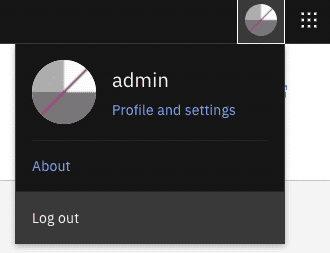

* Click  `Log In`

	

<div style="page-break-after: always;"></div>

* Select `Change your Authentication method`

	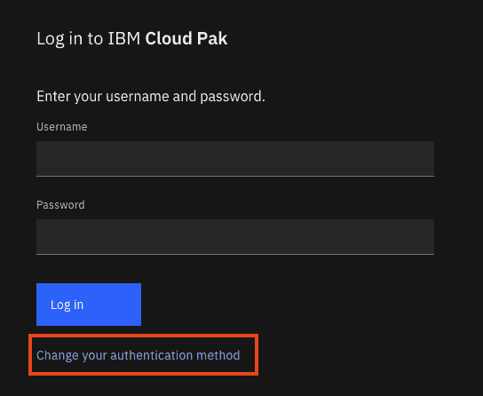
	
* Select `Enterprise LDAP`

	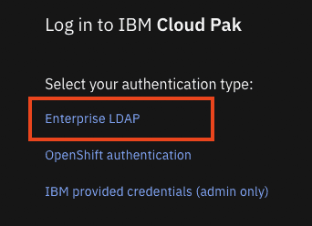
	
<div style="page-break-after: always;"></div>	
* Login with the demo credentials
	* 	User: demo
	*  Password: P4ssw0rd!

	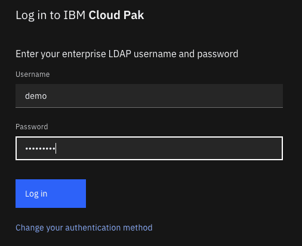
	
<div style="page-break-after: always;"></div>


## 4.3 Enable Story creation Policy


* In the `AI Manager` "Hamburger" Menu select `Operate`/`Automations`
* Under `Policies`
* Select `Stories` from the `Tag` dropdown menu
	
	
* Enable `Default story creation policy for high severity alerts`
* Also enable `Default story creation policy for all alerts` if you want to get all alerts grouped into a story
	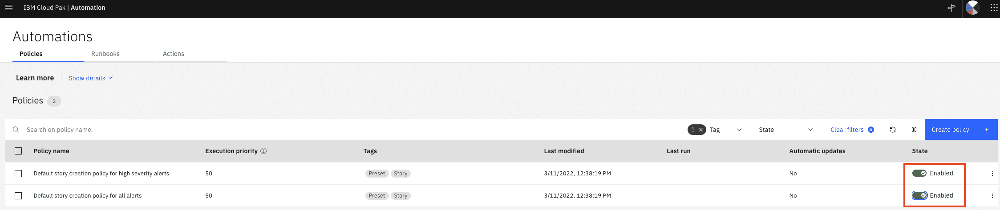
	


>‚ùó Wait for the playbook to complete before continuing

<div style="page-break-after: always;"></div>


## 4.5 Create Integrations


### 4.5.1 Create Integrations 

‚ùó Do this only after the training has completed!

#### 4.5.1.1 Create Kafka ELK Log Inception Integration 

* In the `AI Manager` "Hamburger" Menu select `Define`/`Data and tool integrations`
* Click `Add connection`
 
	
	
* Under `Kafka`, click on `Add Connection`
	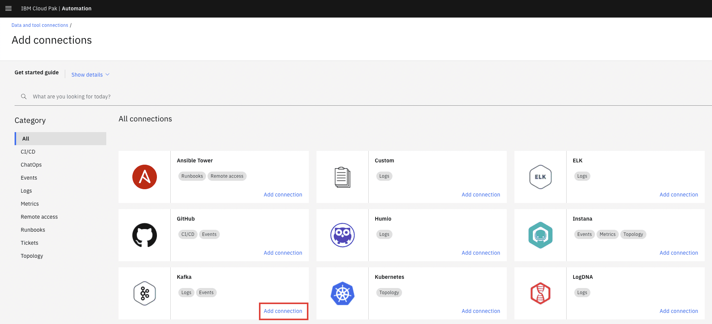
	
* Click `Connect`

* Name it `ELKInception`
* Set `Base Parallelism` to `5`
	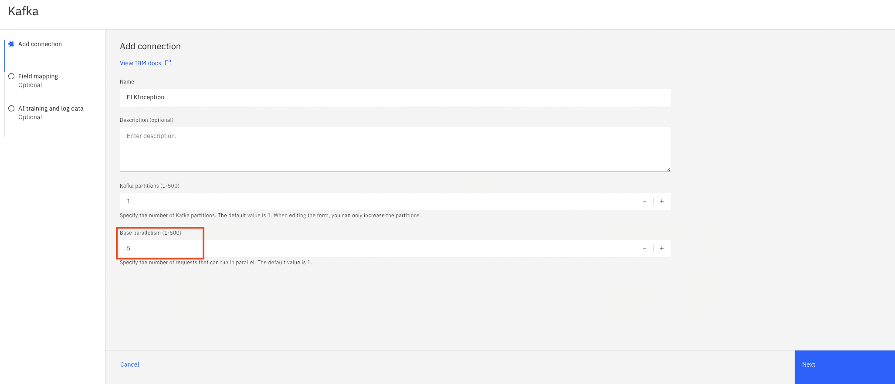
	
* Click `Next`
	
* Select `Data Source` / `Logs`
	
* Select `Mapping Type` / `ELK`

<div style="page-break-after: always;"></div>

* Paste the following in `Mapping` (the default is **incorrect**!:

	```json
	{ 
	  "codec": "elk",
	  "message_field": "message",
	  "log_entity_types": "kubernetes.container_image_id, kubernetes.host, kubernetes.pod_name, kubernetes.namespace_name",
	  "instance_id_field": "kubernetes.container_name",
	  "rolling_time": 10,
	  "timestamp_field": "@timestamp"
	}
	```
	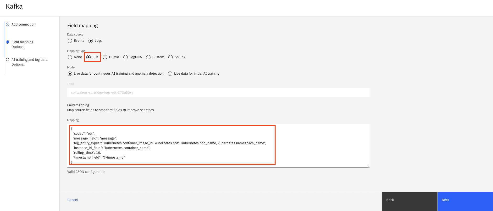
 	
* Click `Next`
* Toggle `Data Flow` to the `ON` position
	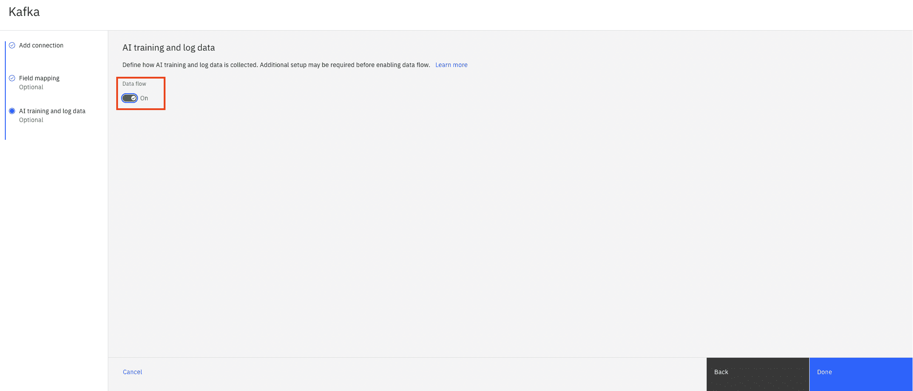
 	
* Select `Live data for continuous AI training and anomaly detection`
* Click `Save`


<div style="page-break-after: always;"></div>

#### 4.5.1.2 Create Kafka Netcool Inception Integration 

* In the `AI Manager` "Hamburger" Menu select `Operate`/`Data and tool integrations`
* Click `Add connection`

	
 	
* Under `Kafka`, click on `Add Connection `

	
 	
* Click `Connect`
* Name it `EventManagerInception`
	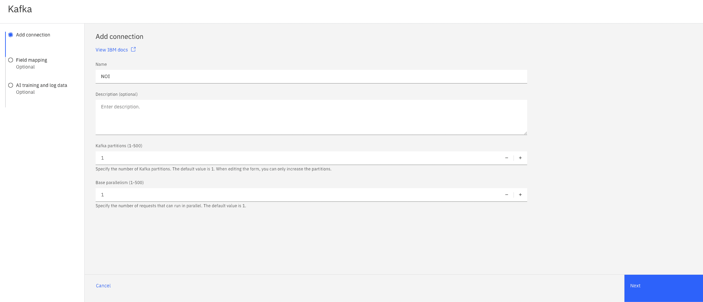
 	
* Click `Next`
* Select `Data Source` / `Events`
* Select `Mapping Type` / `NOI`
	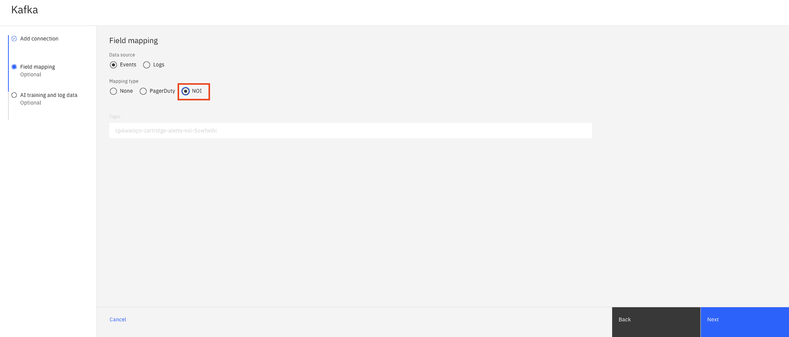
 
* Click `Next`
* Toggle `Data Flow` to the `ON` position
* Click `Save`

<div style="page-break-after: always;"></div>


## 4.6 Create AWX Connection 

* In the `AI Manager` "Hamburger" Menu select `Define`/`Data and tool integrations`
* Click `Add connection`
	
* Under `Ansible Tower`, click on `Add Connection`
	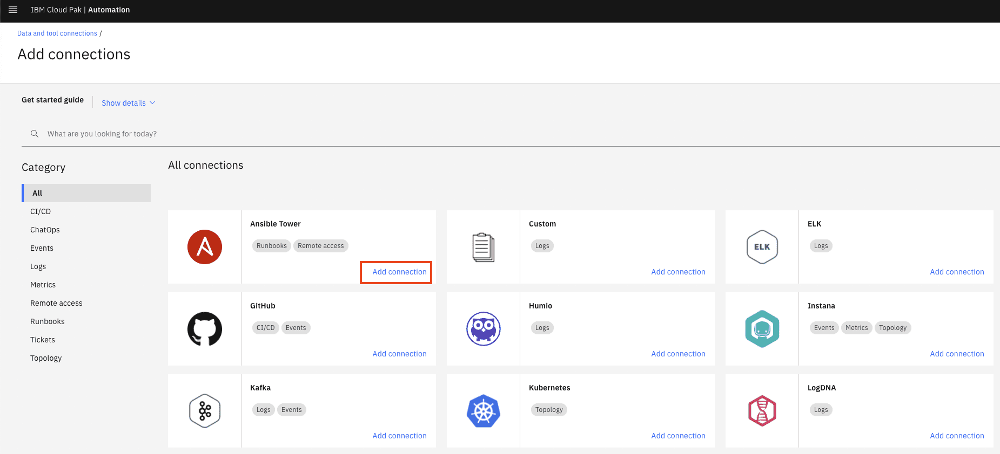
 

* Click `Connect`

<div style="page-break-after: always;"></div>

* Open the `LOGINS.txt` or the `installAIManager.log` file that has been created by the Installer in your root directory
	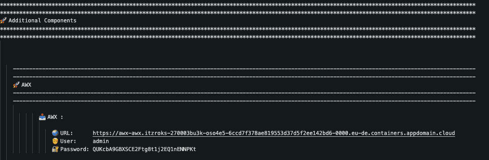
* Fill in `URL` with the URL from `LOGINS.txt`
* Fill in `User ID` with `admin`
* Fill in `Password` with the password from `LOGINS.txt`
	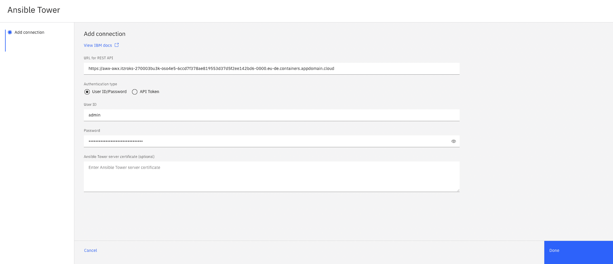
 

* Click `Save`

<div style="page-break-after: always;"></div>


## 4.7 Create AI Manager Runbook 


1. Restart the Easy Installer:

```bash
./01_easy-install.sh
```

2. Select option üê•`03` to finalize `AI Manager` installation.


Or directly run:

```bash
ansible-playbook ./ansible/03_aimanager-finalize-install.yaml
```

<div style="page-break-after: always;"></div>

---------------------------------------------------------------
# 5. AI Manager Finalize Configuration 
---------------------------------------------------------------

> ‚ùó Make sure the playbook `03` has completed before continuing


> You have to do the following:
> 
> 1. Publish Runbook
> 1. Create Runbook Policy 
> 1. Now you can create the Slack Integration


## 5.1 Publish Runbook 


* In the `AI Manager` "Hamburger" Menu select `Operate`/`Automations`
* Select `Runbooks` tab
* For the` Mitigate RobotShop Problem` click on the three dots at the end of the line
* Click `Edit`

	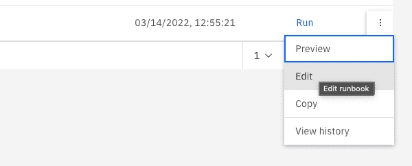
	
* Click on the blue `Publish` button

	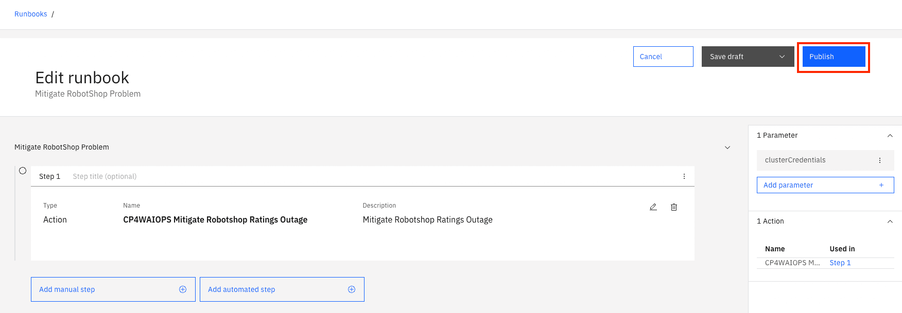

<div style="page-break-after: always;"></div>

## 5.2 Create Runbook Policy 


* In the `AI Manager` "Hamburger" Menu select `Operate`/`Automations`
* Under `Policies`, click `Create Policy`
	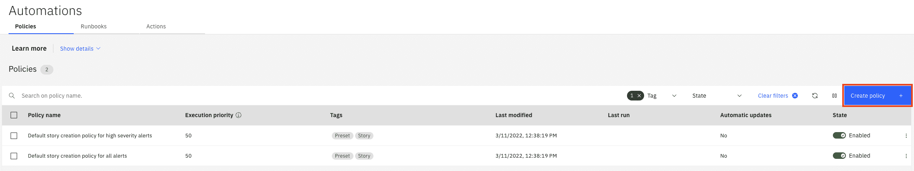
 

* Select `Assign a runbook to alerts`
	
 
<div style="page-break-after: always;"></div>

* Name it `Mitigate RobotShop`
	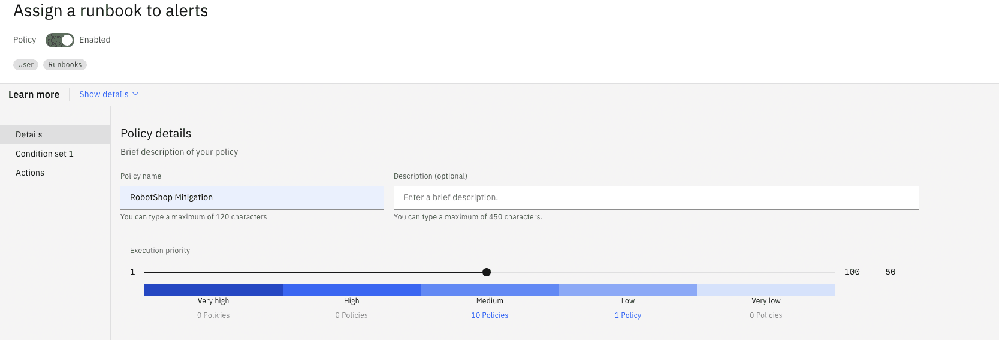
 

* Under `Condition set1`
* Select `resource.name` (you can type `name` and select the name field for resources)

	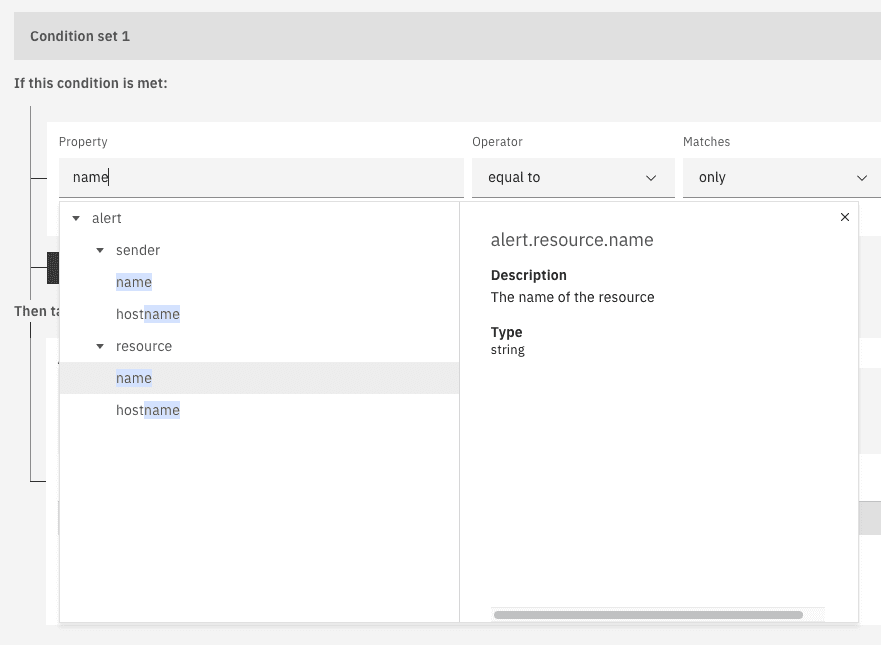
 	
* Set Operator to `contains`

	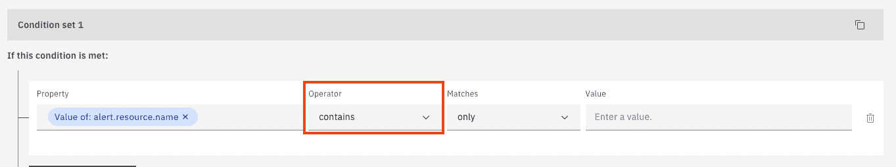
 	
<div style="page-break-after: always;"></div>

* And for `value` you type `mysql` (select `String: mysql`)

	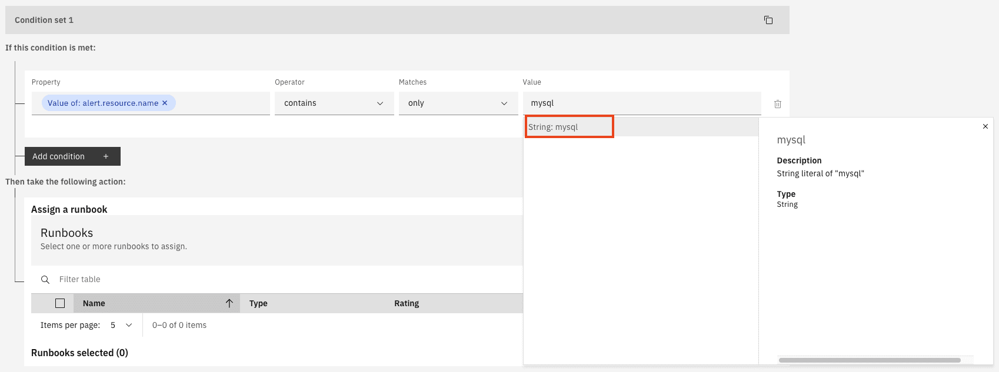
 	
* Under Runbooks
* Select the `Mitigate RobotShop Problem` Runbook

	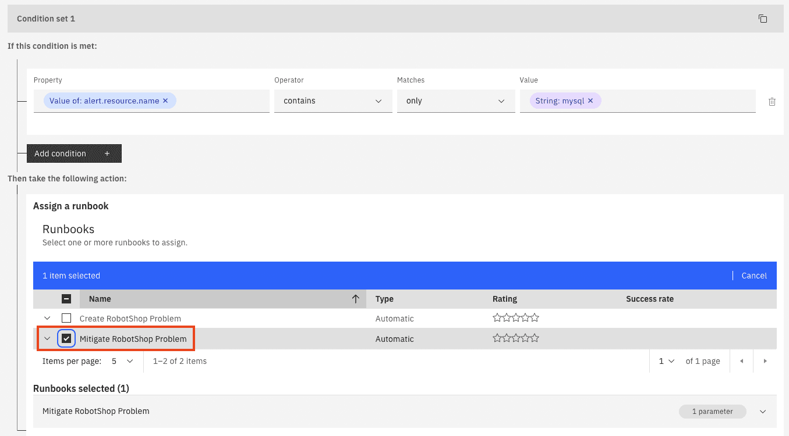

<div style="page-break-after: always;"></div>

* Under `Select Mapping Type`, select `Use default parameter value` (this has been prefilled by the installer)

	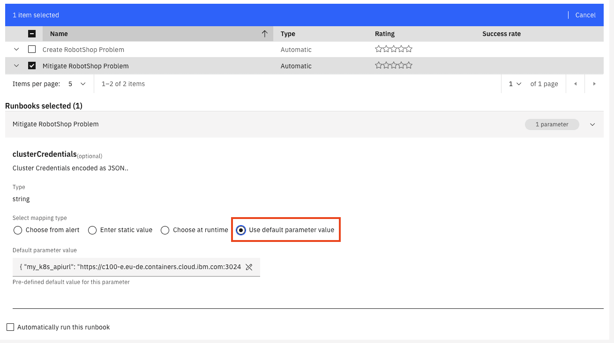
 	

* Click `Create Policy`


<div style="page-break-after: always;"></div>

---------------------------------------------------------------
# 6. Slack integration
---------------------------------------------------------------


For the system to work you need to follow those steps:

1. Create Slack Workspace
1. Create Slack App
1. Create Slack Channels
1. Create Slack Integration
1. Get the Integration URL
1. Create Slack App Communications
1. Slack Reset

<div style="page-break-after: always;"></div>

## 6.1 Create your Slack Workspace

1. Create a Slack workspace by going to https://slack.com/get-started#/createnew and logging in with an email <i>**which is not your IBM email**</i>. Your IBM email is part of the IBM Slack enterprise account and you will not be able to create an independent Slack workspace outside if the IBM slack service. 

  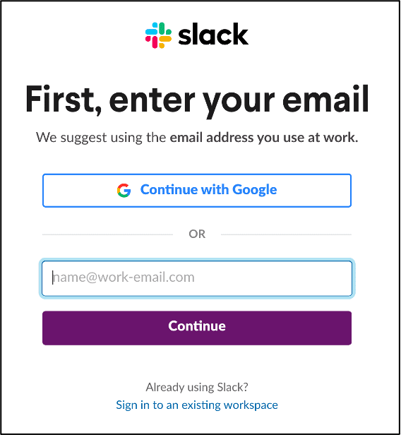

2. After authentication, you will see the following screen:

  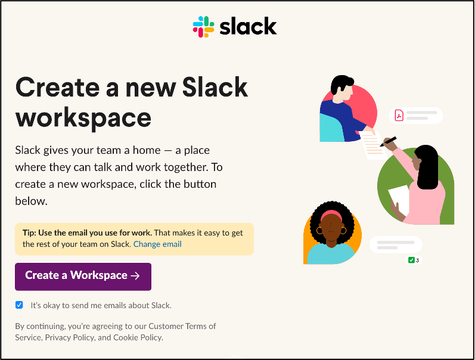

3. Click **Create a Workspace** ->

4. Name your Slack workspace

  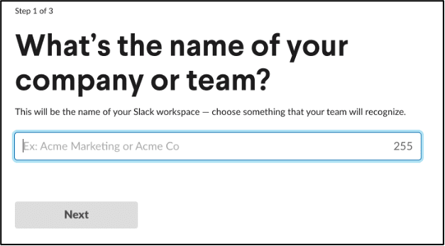

  Give your workspace a unique name such as aiops-\<yourname\>.

5. Describe the workspace current purpose

  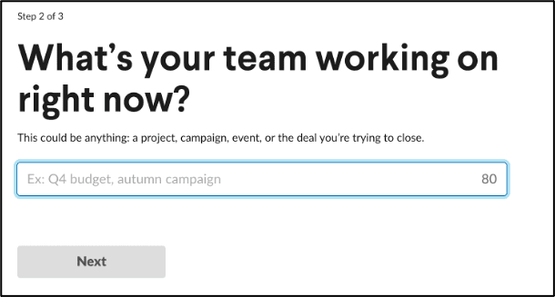

  This is free text, you may simply write “demo for Watson AIOps” or whatever you like.

6. 

  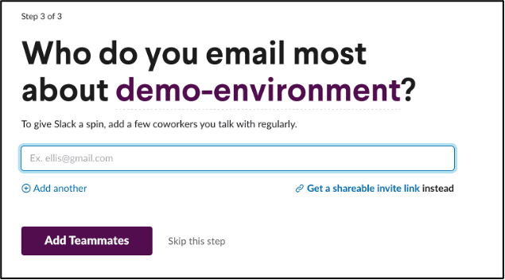

  You may add team members to your new Slack workspace or skip this step.


At this point you have created your own Slack workspace where you are the administrator and can perform all the necessary steps to integrate with CP4WAOps.

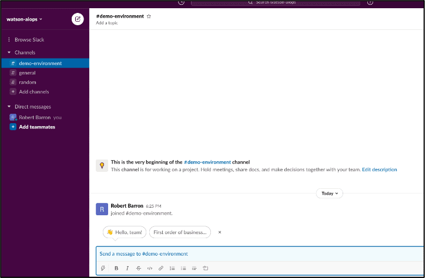

**Note** : This Slack workspace is outside the control of IBM and must be treated as a completely public environment. Do not place any confidential material in this Slack workspace.

<div style="page-break-after: always;"></div>

## 6.2 Create Your Slack App

1. Create a Slack app, by going to https://api.slack.com/apps and clicking `Create New App`. 

   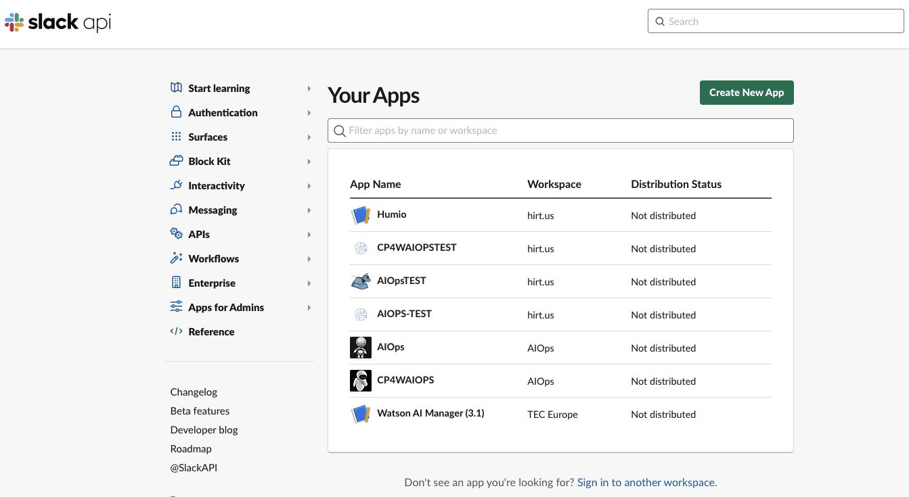


2. Select `From an app manifest`


  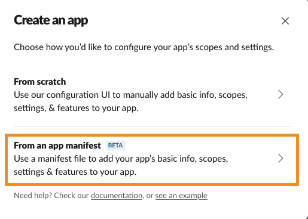

3. Select the appropriate workspace that you have created before and click `Next`

4. Copy and paste the content of this file [./doc/slack/slack-app-manifest.yaml](./slack-app-manifest.yaml).

	Don't bother with the URLs just yet, we will adapt them as needed.

5. Click `Next`

5. Click `Create`

6. Scroll down to Display Information and name your CP4WAIOPS app.

7. You can add an icon to the app (there are some sample icons in the ./tools/4_integrations/slack/icons folder.

8. Click save changes

9. In the `Basic Information` menu click on `Install to Workspace` then click `Allow`

<div style="page-break-after: always;"></div>

## 6.3 Create Your Slack Channels


1. In Slack add a two new channels:
	* aiops-demo-reactive
	* aiops-demo-proactive

	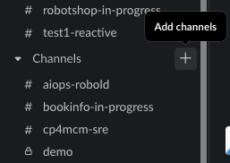


2. Right click on each channel and select `Copy Link`

	This should get you something like this https://xxxx.slack.com/archives/C021QOY16BW
	The last part of the URL is the channel ID (i.e. C021QOY16BW)
	Jot them down for both channels
	
3. Under Apps click Browse Apps

	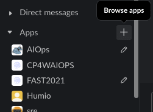

4. Select the App you just have created

5. Invite the Application to each of the two channels by typing

	```bash
	@<MyAppname>
	```

6. Select `Add to channel`

	You shoud get a message from <MyAppname> saying `was added to #<your-channel> by ...`


<div style="page-break-after: always;"></div>

## 6.4 Integrate Your Slack App

In the Slack App: 

1. In the `Basic Information` menu get the `Signing Secret` (not the Client Secret!) and jot it down

	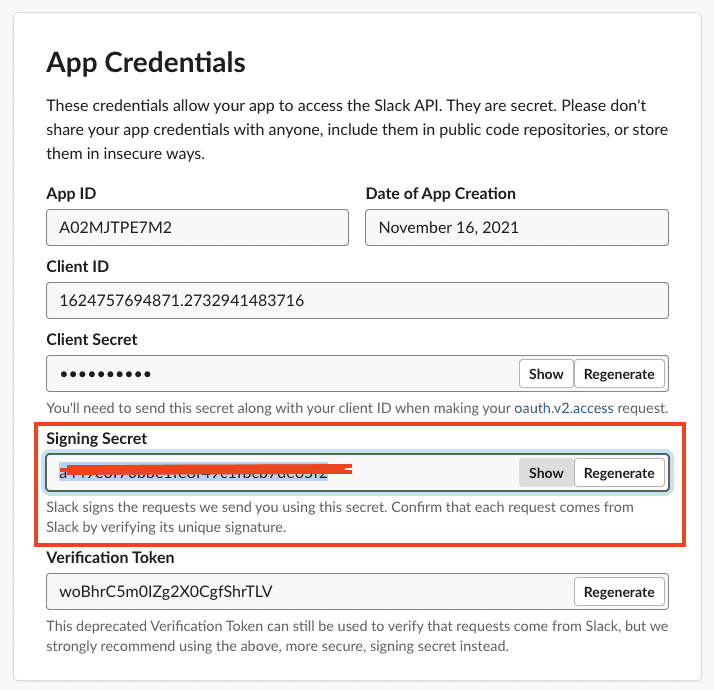
	
3. In the `OAuth & Permissions` get the `Bot User OAuth Token` (not the User OAuth Token!) and jot it down

	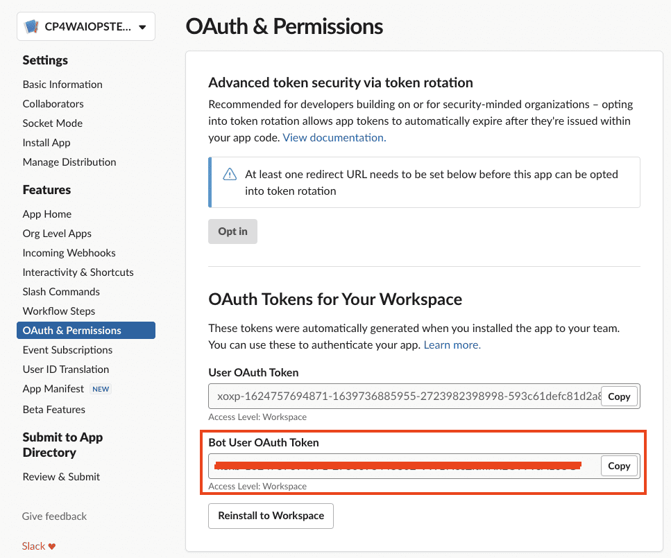

In the AI Manager (CP4WAIOPS) 

1. In the `AI Manager` "Hamburger" Menu select `Define`/`Data and tool integrations`
1. Click `Add connection`
 
	
	
1. Under `Slack`, click on `Add Connection`
	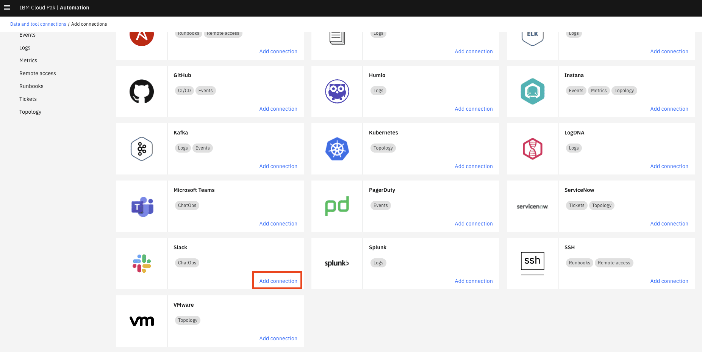

6. Name it "Slack"
7. Paste the `Signing Secret` from above
8. Paste the `Bot User OAuth Token` from above

	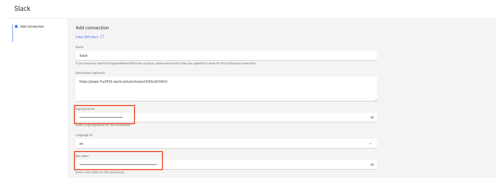
	
9. Paste the channel IDs from the channel creation step in the respective fields

	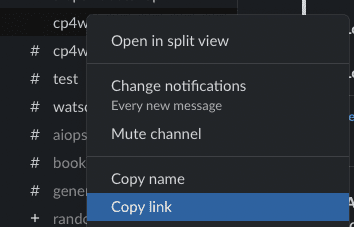
	
	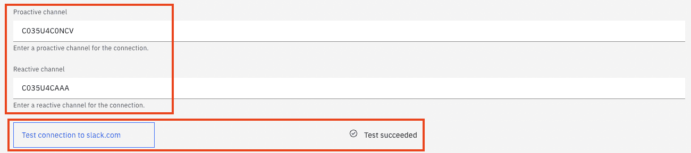
		
		

10. Test the connection and click save


<div style="page-break-after: always;"></div>

## 6.5 Create the Integration URL

In the AI Manager (CP4WAIOPS) 

1. Go to `Data and tool integrations`
2. Under `Slack` click on `1 integration`
3. Copy out the URL

	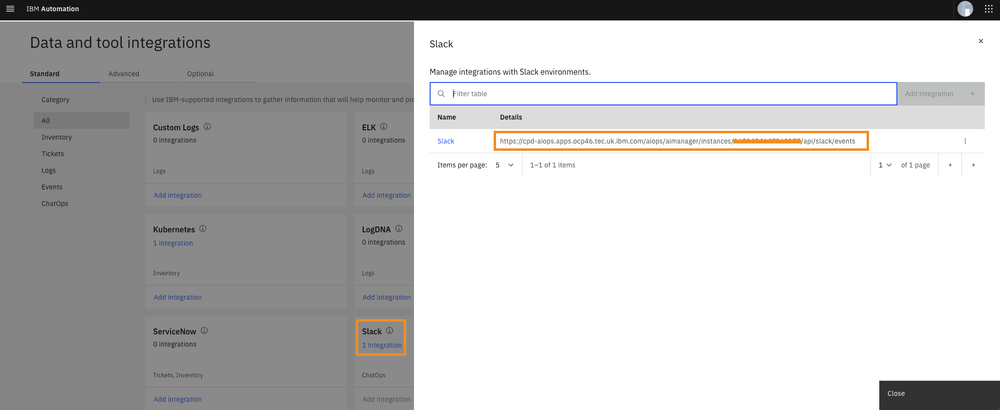

This is the URL you will be using for step 6.


<div style="page-break-after: always;"></div>

## 6.6 Create Slack App Communications

Return to the browser tab for the Slack app. 

### 6.6.1 Event Subscriptions

1. Select `Event Subscriptions`.

2. In the `Enable Events` section, click the slider to enable events. 

3. For the Request URL field use the `Request URL` from step 5.

	e.g: `https://<my-url>/aiops/aimanager/instances/xxxxx/api/slack/events`

4. After pasting the value in the field, a *Verified* message should display.

	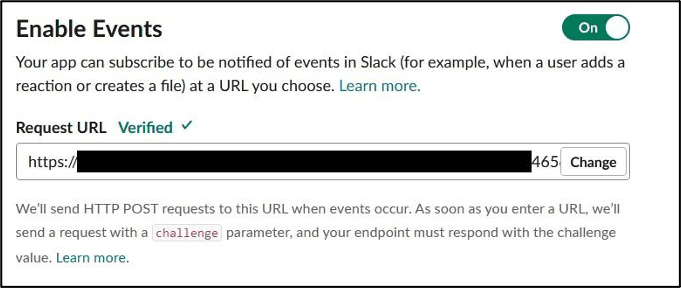

	If you get an error please check 5.7

5. Verify that on the `Subscribe to bot events` section you got:

	*  `app_mention` and 
	*  `member_joined_channel` events.

	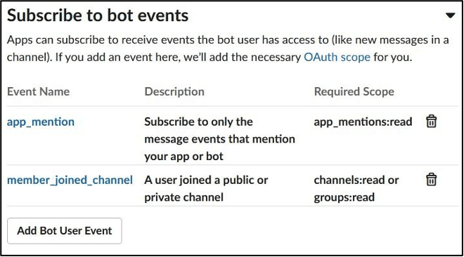

6. Click `Save Changes` button.


### 6.6.2 Interactivity & Shortcuts

7. Select `Interactivity & Shortcuts`. 

8. In the Interactivity section, click the slider to enable interactivity. For the `Request URL` field, use use the URL from above.

 **There is no automatic verification for this form**

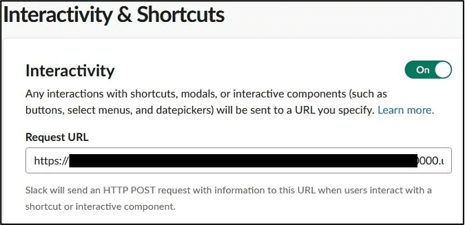

9. Click `Save Changes` button.

### 6.6.3 Slash Commands

Now, configure the `welcome` slash command. With this command, you can trigger the welcome message again if you closed it. 

1. Select  `Slash Commands`

2. Click `Create New Command` to create a new slash command. 

	Use the following values:
	
	
	| Field | Value |
	| --- | --- |
	|Command| /welcome|
	|Request URL|the URL from above|
	|Short Description| Welcome to Watson AIOps|

3. Click `Save`.

### 6.6.4 Reinstall App

The Slack app must be reinstalled, as several permissions have changed. 

1. Select `Install App` 
2. Click `Reinstall to Workspace`

Once the workspace request is approved, the Slack integration is complete. 

If you run into problems validating the `Event Subscription` in the Slack Application, see 5.2

<div style="page-break-after: always;"></div>

<div style="page-break-after: always;"></div>

## 6.7 Create valid CP4WAIOPS Certificate (optional)

Installer should aready have done this.

But if there still are problems, you can directly run: 

```bash
ansible-playbook ./ansible/31_aimanager-create-valid-ingress-certificates.yaml
```


<div style="page-break-after: always;"></div>

## 6.8 Slack Reset


### 6.8.1 Get the User OAUTH Token

This is needed for the reset scripts in order to empty/reset the Slack channels.

This is based on [Slack Cleaner2](https://github.com/sgratzl/slack_cleaner2).
You might have to install this:

```bash
pip3 install slack-cleaner2
```
#### Reset reactive channel 

In your Slack app

1. In the `OAuth & Permissions` get the `User OAuth Token` (not the Bot User OAuth Token this time!) and jot it down

In file `./tools/98_reset/13_reset-slack.sh`

2. Replace `not_configured` for the `SLACK_TOKEN` parameter with the token 
3. Adapt the channel name for the `SLACK_REACTIVE` parameter


#### Reset proactive channel 

In your Slack app

1. In the `OAuth & Permissions` get the `User OAuth Token` (not the Bot User OAuth Token this time!) and jot it down (same token as above)

In file `./tools/98_reset/14_reset-slack-changerisk.sh`

2. Replace `not_configured` for the `SLACK_TOKEN` parameter with the token 
3. Adapt the channel name for the `SLACK_PROACTIVE` parameter


### 6.8.2 Perform Slack Reset

Call either of the scripts above to reset the channel:

```bash

./tools/98_reset/13_reset-slack.sh

or

./tools/98_reset/14_reset-slack-changerisk.sh

```


---------------------------------------------------------------
# 7. Demo the Solution
---------------------------------------------------------------


## 7.1 Simulate incident - Command Line

**Make sure you are logged-in to the Kubernetes Cluster first** 

In the terminal type 

```bash
./tools/01_demo/incident_robotshop.sh
```

This will delete all existing Alerts/Stories and inject pre-canned event and logs to create a story.

ℹ️  Give it a minute or two for all events and anomalies to arrive in Slack.


